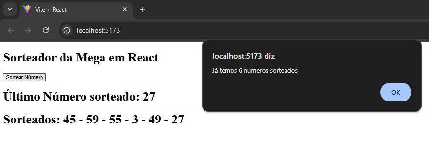

# Exercícios 2

Crie um componente chamado “HookMegaSena”
- Nele, inicialize um useState que armazena um número sorteado, que tem o estado inicial vazio.
- Crie outro useState com o estado inicial de um array vazio para armazenar os números sorteados
- Seu componente terá uma função chamada: sortearNumero
- Essa função deve abastecer o “useState” de número sorteado com um número aleatório entre 1 e 60.
- Sintaxe: Math.floor(Math.random() * 60) + 1
- Também deve ir armazenando os valores já sorteados em um array.
- Sintaxe: [...arrayNumerosSorteados , sorteado]
- Não permitir que um novo número seja sorteado se o array já tiver o tamanho de 6 elementos.
- Se isso acontecer, exibir um alert: “Já temos 6 números sortedos!”
- Exibir na tela as informações como demonstra o print ao lado.
- Criar o button Sortear Número para chamar a sua função.

# Resultado

