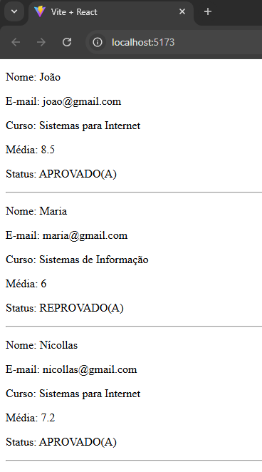

# Exercício 3

### • Refaça o exercício anterior utilizando Fragments no
componente “Aluno” para evitar o elemento pai
“
”:

### • Crie um componente chamado “Aluno” que vai
renderizar informações sobre um aluno, como: nome,
email, curso, media e status.
### • Em vez de acessar cada propriedade individualmente
dentro do componente, utilize a técnica de
destructuring para extrair as propriedades “nome”,
“email”, “curso”, “media” de uma vez só
### • Renderize o componente “Aluno” em um elemento da
página.
### • Para isso crie um array com 3 alunos em objetos literais.
### • Percorra esse array através de .map para renderizar
esses 3 alunos na tela.
### • Para o item “status” deve ser exibida a mensagem
“APROVADO(A)” ou “REPROVADO(A)”
### • Se a média for maior ou igual a 7.00 -> Aprovado
### • Se não -> Reprovado.

## Resultado:

